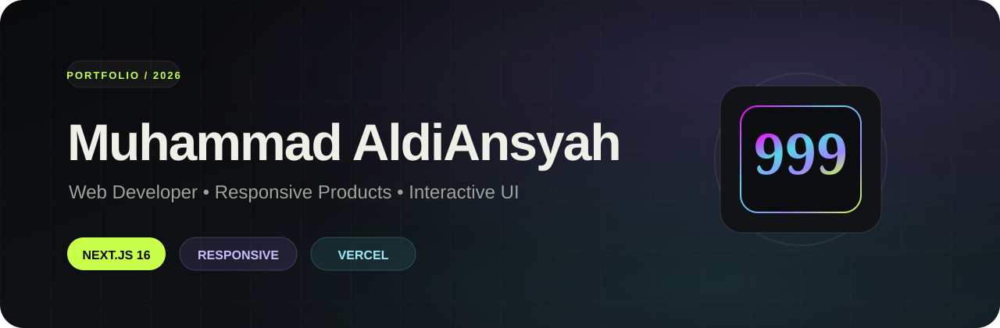

<p align="center">
  
</p>

<p align="center">
  <strong>Personal portfolio built around the 999 identity.</strong><br>
  Responsive, animated, and designed for desktop and mobile.
</p>

<p align="center">
  <a href="https://whoami-alpha-amber.vercel.app"></a>
  
  
  
  
</p>

<p align="center">
  <a href="https://whoami-alpha-amber.vercel.app">Live Site</a> ·
  <a href="#fitur-utama">Features</a> ·
  <a href="#tech-stack">Stack</a> ·
  <a href="#menjalankan-lokal">Local Setup</a>
</p>

---

## Tentang proyek

`whoami` adalah portfolio personal Muhammad AldiAnsyah. Website ini menampilkan profil, proyek, sertifikat, dan kontak dalam satu pengalaman visual yang fokus pada responsivitas, animasi ringan, dan identitas `999`.

Tampilan utamanya memakai dark interface dengan aksen lime, violet, cyan, dan gradient neon. Struktur desktop dan mobile dibuat agar tetap nyaman dipakai pada ukuran layar yang berbeda.

## Fitur utama

| Area | Implementasi |
| --- | --- |
| Branding | Identitas `999` dengan typography dan gradient animated |
| Hero | Intro profil, status, social links, dan CTA |
| Projects | Project cards dengan detail stack dan case view |
| About | Ringkasan profil dan kemampuan |
| Certificates | Sertifikat yang dapat dibuka langsung dari portfolio |
| Contact | Social links dan jalur kontak |
| Responsive | Desktop navigation dan mobile navigation terpisah |
| Interaction | Modal, hover states, scroll progress, dan micro-animation |

## Visual system

Palet utama mengikuti website:

```text
Night      #090a0c
Ink        #eef0e8
Lime       #c7ff4a
Violet     #9b87ff
Cyan       #56d6e7
```

Elemen `999` dipertahankan sebagai identitas visual utama, termasuk pada brand mark di header.

## Tech stack

| Layer | Teknologi |
| --- | --- |
| Framework | Next.js 16.2.6 |
| UI | React 19.2.6 |
| Language | TypeScript 5.9 |
| Icons | Lucide React |
| Styling | Custom CSS |
| Deployment | Vercel |
| Runtime | Node.js 22.13+ |

## Struktur halaman

```text
Hero
  ↓
Projects
  ↓
About
  ↓
Certificates
  ↓
Contact
```

Navigasi desktop menggunakan header tetap. Mobile menggunakan navigation bar khusus agar akses section tetap cepat tanpa memadatkan header.

## Menjalankan lokal

```bash
git clone https://github.com/Aldyy002-ctrl/whoami.git
cd whoami

npm install
npm run dev
```

Buka:

```text
http://localhost:3000
```

## Production build

```bash
npm run build
npm start
```

## Deployment

Repository ini dikonfigurasi untuk deployment di Vercel.

Live site:

https://whoami-alpha-amber.vercel.app

## Project goals

- Menampilkan karya dalam format yang cepat dipahami.
- Mempertahankan identitas visual `999`.
- Nyaman dipakai di desktop dan mobile.
- Animasi tetap terasa hidup tanpa membuat interface berat.
- Project dan sertifikat mudah ditemukan.
- Struktur tetap sederhana untuk dikembangkan lagi.

---

<p align="center">
  <sub>Built with Next.js, React, TypeScript, and a lot of 999.</sub>
</p>
